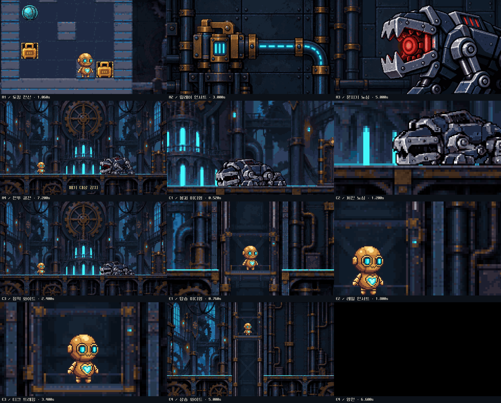
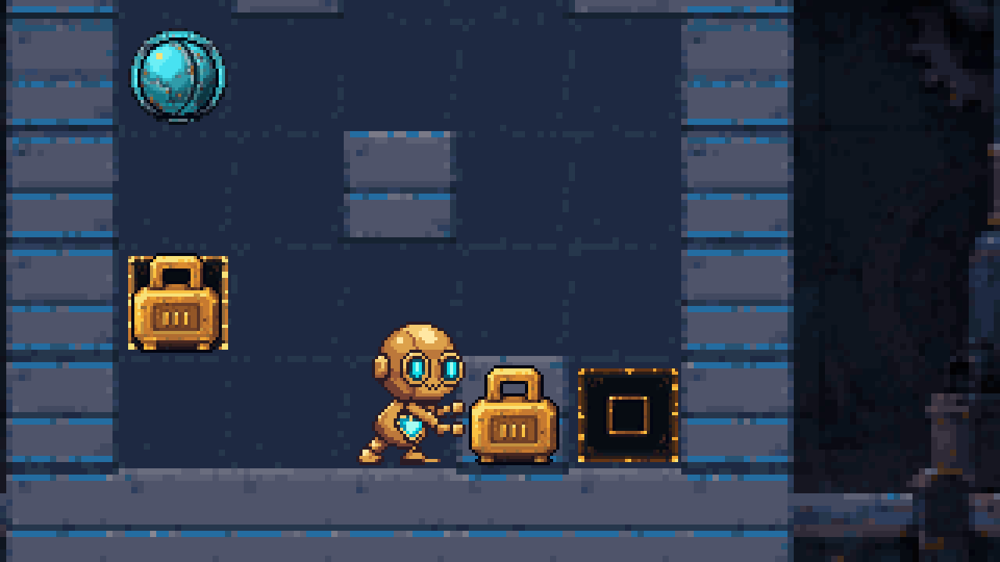
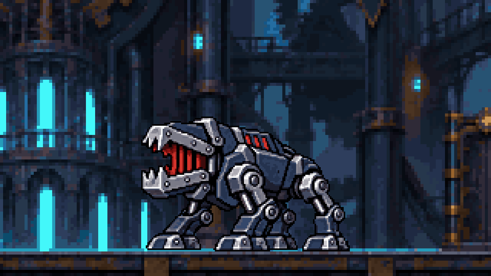
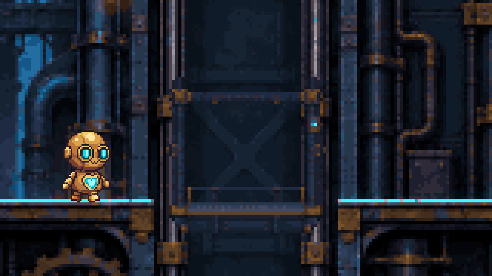

# 최신 작업 전달 — 2026-10-04

Git에는 게임 소스, 런타임 에셋, 실제 이미지 생성 원본·프롬프트·참조,
네이티브 파생 자료, 편집 가능한 Piskel, PNG/APNG/GIF, 검증 기록을 포함한다.
현재 연출 후보는 **cinematic edit v4**이고, 이전 시안은 비교·출처 보존용이다.
기술 검사 통과와 사용자의 외형·동작·재미 승인은 별개다.

## 최신 연출 후보

공방·도착층·하차는 보여주지 않는다. 기동 8초, 쓰러짐 3초, 탑승·상승 7초의
독립 클립이며, 아직 게임에 연결하지 않았다. 기존 낙하 오프닝은 유지했다.

- [전체 구성·11샷 타임라인](return-cinematic-edit-v4/storyboard.md)
- [이미지 생성 요청](return-cinematic-edit-v4/Source/requests.json)
- [원본·참조 출처](return-cinematic-edit-v4/Source/provenance.json)
- [223프레임 합성·카메라 검증](return-cinematic-edit-v4/QA/composition-validation.json)
- [내보내기 검증](return-cinematic-edit-v4/QA/validation.json)

## 게임 변경

- [게임 실행·조작·검증 안내](../unity/TiqueReturnPrototype/README.md)
- [작은 UI·자동 실패 안내·도트 폰트·시작 위치 수정](../unity/TiqueReturnPrototype/Docs/WorkOrderV01/compact-ui-v2.md)
- [image-first 퍼즐 식별성 V2](../unity/TiqueReturnPrototype/Docs/WorkOrderV01/readability-image-first-v2.md)
- [전투 재시작·낙하 회피 반격](../unity/TiqueReturnPrototype/Docs/WorkOrderV01/readability-counter-v1.md)
- [문지기 V8 뒤틀림 개선](../unity/TiqueReturnPrototype/Docs/WorkOrderV01/guardian-v8.md)

다른 PC에서는 Unity 프로젝트를 열거나 소스에서 빌드한다. 현재 PC 바탕화면의
실행 앱·로컬 빌드 자체는 Git 전달물이 아니다.

이번 소스 재검사에서 자동 안내·UI·전투 모델 검사와 C# 런타임 컴파일이 통과했다.
`QA/V8/animation-model-checks.json`은 현재 문지기 V8 검사이고, 같은 경로에 있던
과거 티크 V8 증거는 `QA/V8/tique-animation-model-checks-legacy.json`으로 함께 보존한다.

## Git에서 제외한 로컬 파일

- Unity 빌드·Library·컴파일 캐시와 `.DS_Store`.
- 시네마틱 `Clips/**/*.pixels.json`: 프레임별 픽셀 차이를 풀어 쓴 대용량 캐시.
  PNG, Piskel, APNG, 시간표, 생성·파생 자료는 포함한다. 이 캐시는 원본 PNG와
  패키징 도구로 재생성할 수 있다. UI·문지기·퍼즐의 작은 픽셀 편집 자료는 포함한다.
- `return-pixel-cinematics-v2-full/QA/video-preview-build-*`: 미완성 영상 인코딩 실험.
  최종 MP4가 있다는 뜻이 아니다.

위 파일은 삭제하지 않았고 제작 PC에 보존한다. 이전 `*-draft-01`의 생성·편집·출력
자료도 픽셀 차이 캐시를 제외하고 함께 전달한다. 기존 QA가 캐시 경로·해시를
기록한 것은 제작 당시 검사 사실이며, 새 체크아웃에 해당 캐시가 있다는 뜻은 아니다.

## 재현 시 주의

최신 패키지의 재생성 진입점은 저장소 루트에서
`python tools/art/package_cinematic_edit_v4.py --inspected-anchors`이다.
Pillow·NumPy가 필요하며, 기존 출력과 다른 파일은 덮어쓰지 않고 중단한다.
`--inspected-anchors`는 이미지 생성·검수를 생략하는 자동 승인 옵션이 아니다.

출처 JSON의 절대경로는 제작 당시 원본 위치를 기록한다. 보존된 원본·참조 사본은
각 `Source/` 아래에 있다. 기존 독립 검사 일부는 이 사본뿐 아니라 제작 PC의 원본
절대경로도 확인하므로, 다른 PC에서 그대로 실행하면 경로 검사가 실패할 수 있다.
파일 누락이나 이미지 생성 생략을 뜻하지 않는다. 다른 PC 검증은 보존 사본과
기록된 SHA를 기준으로 원본 경로를 매핑해야 하며, 과거 출처·해시를 임의로 수정하면 안 된다.

구도·생성 원본·동작 변경을 하려면 [프로젝트 제작 규칙](../AGENTS.md)을 먼저 읽는다.
해시가 기록된 제작 스크립트를 바꾸면 새 버전의 파생·검증 기록을 별도로 남긴다.
