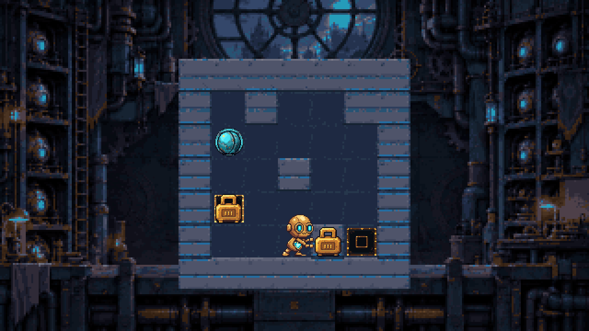
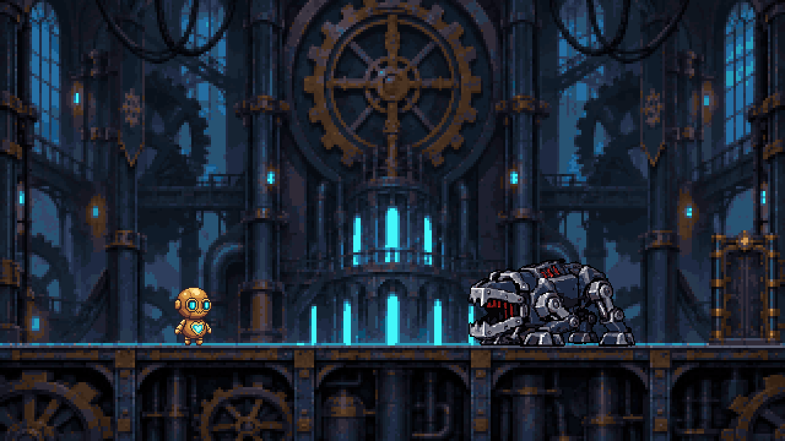
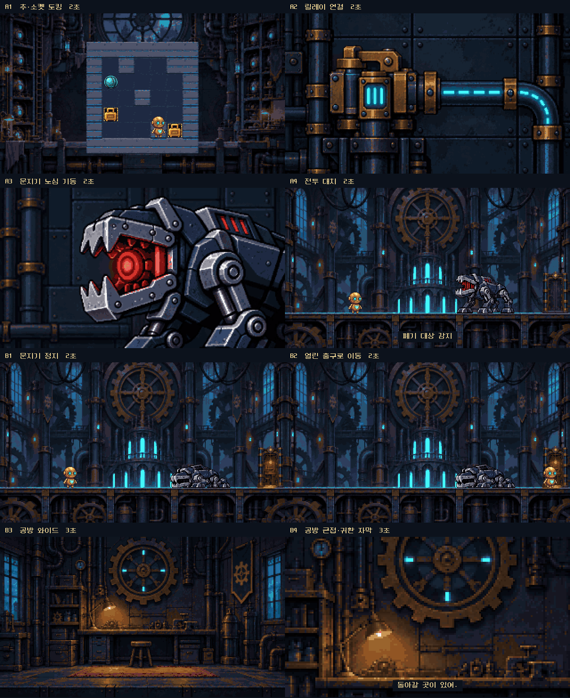

# 티크 — 스토리보드 전체 8컷 / 도트 연출 v2

8컷의 개별 PNG 프레임과 순서 재생본을 모두 제작했다. 캐릭터는 현재 게임이 사용하는 TiqueV10·WardenV8 프레임을 그대로 합성했으며 새로운 캐릭터 포즈를 생성하거나 다시 그리지 않았다.

**오프라인 시각 후보**다. 게임 연동·실행·빌드·오프닝 변경은 하지 않았다. 기술 검증과 사용자의 외형·연출 승인은 별개이며 최종 승인은 대기 중이다.

## 바로 확인

문지기 기동 — 8초:



공방 귀환 — 10초:



GIF는 무음이다. [기동 임시 음향](Sequences/awakening/sound.wav) · [귀환 임시 음향](Sequences/homecoming/sound.wav). 음향은 기존 게임 효과음의 배치·볼륨을 검토하는 임시 믹스이며 전용 공장 저음·시계 녹음은 없다. 새 음원을 생성하거나 내려받지 않았다.

두 시퀀스 사이에는 실제 보스전이 있다. **연속 18초짜리 게임 컷신이 아니며**, 승인된 낙하 오프닝은 포함하지 않는다.

## 전체 구성

| 컷 | 시간 | 제작한 내용 |
|---|---:|---|
| A1 | 2초 | 티크가 황동 사각 추를 밀어 사각 소켓에 도킹. 회색 연결 벽·청록 원형 구슬 유지. |
| A2 | 2초 | 릴레이 활성화와 청록 배선의 전력 전달. 기존 v1 생성·도트 애니메이션 PNG 바이트 그대로 재사용. |
| A3 | 2초 | 문지기 입속 붉은 노심·피스톤 기동. 기존 v1 프레임 그대로 재사용. |
| A4 | 2초 | 왼쪽 티크·오른쪽 문지기 대치. 현재 boot 동작과 ‘폐기 대상 감지’. |
| B1 | 2초 | 현재 defeat를 한 번 재생하고 정지 자세 유지. 노심이 꺼진 뒤 오른쪽 출구 개방. |
| B2 | 2초 | 현재 Walk로 따뜻한 오른쪽 문까지 접근한 뒤 Idle. |
| B3 | 3초 | 조용한 공방 와이드, 작업등 아래 미세한 먼지. 기존 v1 프레임 그대로 재사용. |
| B4 | 3초 | 같은 공방의 같은 작업대 크롭. 마지막 ‘돌아갈 곳이 있어.’ 표시. |



B2의 자동 이동은 **시청본 편집을 위한 것**이다. 실제 게임 연동 시에는 플레이어가 열린 문까지 이동해 상호작용할 때까지 기다리는 원래 기획을 유지해야 한다.

## 이미지-first 제작과 원본 보존

- 신규 배경은 실제 이미지 생성 4회 → 원본 표시·주 에이전트 검수 → 네이티브 도트 변환 순서로 제작했다.
- 퍼즐판·전투 아레나·열린 문 편집 3개를 사용했다. 첫 출구 배경은 바닥 높이와 문 위치가 달라 **미사용**으로 보존했다.
- 원본은 Source/Generated, 실제 요청·참조 SHA는 [provenance.json](Source/provenance.json)과 [requests.json](Source/requests.json), 열린 문 국소 편집 요청은 [exit-edit-request.json](Source/exit-edit-request.json)에 남겼다.
- 새 배경은 게임 화면을 참조한 **스토리보드 후보**이며, 현재 런타임 맵과 바이트 단위로 동일한 화면 또는 이미 적용된 게임 맵이라고 주장하지 않는다.
- B1·B2는 A4의 배경을 공유한다. 열린 문은 생성 편집의 네이티브 직사각형 (578,190)–(638,284)만 합성했다. 그 밖의 바닥·공장 픽셀은 A4와 완전히 같다.
- 새 배경은 원본 전체에 균일 BOX 샘플링 → 320×180 → 기존 64색 팔레트 → 정수 2배 NEAREST의 640×360으로 파생했다. 캐릭터/부품별 늘이기나 새 실루엣 코드 페인팅은 없다.
- 기존 릴레이·노심·공방 생성 원본과 이전 프롬프트·출처 기록도 새 패키지에 보존했다. B4는 B3와 같은 공방 크롭이며 새 물건을 추가하지 않았다.

## 티크·문지기 애니메이션 재사용

- 티크: 64×64 셀, 등록점 (32,56), push-side/Walk 원래 760ms 노출 유지.
- 문지기: **192×176** 셀, 등록점 (96,164). A4는 boot 원래 t400–2400ms만 사용해 첫 정지 홀드 400ms를 생략했다. 포즈를 다시 그리거나 노출을 임의로 줄이지 않았다.
- B1은 defeat/00–05를 원래 110ms 간격으로 진행하고 최종 05를 1450ms 유지한다. 반복 재생하지 않는다.
- Sprite 셀·RGBA·투명 마스크는 바꾸지 않았다. 정수 위치 이동만 사용했다. 소켓을 먼저, 추를 그 위에 합성한다.
- 재사용 원본 복사본·SHA는 [reused-sprites.json](Source/reused-sprites.json), 컷별 배경·프레임·좌표는 Clips/A1…B4/composition.json에 있다.
- 자막은 기존 NeoDunggeunmo 16px 픽셀 폰트, 이진 글리프 마스크로 합성했다. 이미지 생성 한글을 사용하지 않았다.
- ‘현재 게임에서 사용하는 에셋’과 ‘인간이 최종 승인한 에셋’을 혼동하지 않는다. 새 연출과 문지기/가독성 개선 에셋의 외형 승인은 대기 중이다.

## 편집·내보내기와 검증

[클립 계획](Clips/clip-plan.json) · [전체 내보내기 기록](Exports/export-manifest.json) · [픽셀·시간 검증](QA/validation.json) · [음향 검증](QA/audio-validation.json).

- 모든 컷: 640×360, alpha255, PNG 프레임, sheet.png, .piskel, native.apng, GIF.
- 순서 재생: Sequences/awakening과 Sequences/homecoming의 .piskel·APNG·GIF.
- Exports/A1…B4 PNG는 준비된 Clips PNG와 바이트 동일.
- Piskel 시트·APNG는 모든 프레임 RGBA·개별 노출 시간 재검증. Piskel 자체는 고정 fps이므로 **가변 시간의 기준은 clips.json·APNG**다.
- GIF는 전체 시퀀스 공유 팔레트에 정확한 색 인덱스를 배정하며 디더링·재양자화가 없다. 디코딩 후 각 시간 구간의 RGB와 총 8초/10초를 다시 검증했다.
- 사운드는 기존 WAV 4종만 사용한 48kHz PCM16 stereo, 총 18개 큐다. 발소리는 land, 시계 tick은 switch의 작은 일부를 임시 대용했다. 음량 피크/클리핑·PCM 재생만 기술 검증했으며 청취·최종 음향 승인은 별도다.

재제작 명령(프로젝트 루트, 번들 Python 사용):

```sh
/Users/daddung/.cache/codex-runtimes/codex-primary-runtime/dependencies/python/bin/python3 tools/art/compose_full_cinematics_v2.py --inspected-anchors
/Users/daddung/.cache/codex-runtimes/codex-primary-runtime/dependencies/python/bin/python3 tools/art/package_full_cinematics_v2.py --inspected-anchors
/Users/daddung/.cache/codex-runtimes/codex-primary-runtime/dependencies/python/bin/python3 tools/art/mix_full_cinematics_v2_audio.py --check-only
```

기존과 다른 출력이 있으면 덮어쓰지 않고 멈춘다. 소스의 생성·검수 사실이 없는 경우 플래그를 임의로 켜서 파이프라인을 시작하면 안 된다.

## 다음 피드백

1. A1→A2→A3의 ‘내가 켠 전원이 문지기를 깨웠다’가 읽히는지.
2. A4가 실제 전투로 자연스럽게 이어지는지.
3. B1→B2의 위험 해소·따뜻한 출구 대비가 충분한지.
4. B4의 자막·가까운 구도·여운 길이를 유지할지.

범위: **전체 8컷 에셋 제작 및 오프라인 순서 재생 검증 완료 / 사용자 연출 승인 대기 / 게임 연동 미실행**.
