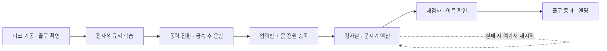

# 티크: 귀환 — 퍼즐 → 문지기 액션 기획안

작성일: 2026-09-30\
상태: `[proposal]` 사용자 검토용. 게임 구현 전 단계.\
목표: 2026년 11월 전 졸업작품 제출용, 처음 접하는 관람객이 약 5분에 시작과 결말을 경험하는 단편.

## 1. 한 문장 기획

**고철로 분류된 작은 조수 로봇이 폐기장의 장치를 고쳐 길을 열고, 자신을 막는 문지기를 정상화해 이름과 귀환 경로를 되찾는다.**

1페이즈는 안전한 환경에서 관찰하고 조작하는 퍼즐, 2페이즈는 문지기의 공격을 읽고 피하고 반격하는 액션이다. 두 장르를 연결하는 공통 장치는 전자석이다. 퍼즐에서 익힌 장치가 전투에서 유리한 기회를 만들어 준다.

### 사용자 요구 / 현재 자산 / 신규 제안의 구분

- 사용자 요구: 티크 유지, 5분 안팎, 1페이즈 퍼즐, 2페이즈 문지기 액션, 짧아도 완결되는 이야기, 레퍼런스 기반 제작, 기획 보고 후 게임 구현.
- 현재 자산: `prototypes/tique-playground`의 revision 10 기본형 대기·걷기·뒤쪽 팔 공격·점프·더블점프·대시와 기본 이동 물리. 적 AI, 공격 피해, 퍼즐, 이야기 진행은 아직 없다.
- 신규 제안: 폐기장 출구 검사소, 오작동한 문지기, 전자석 운반 퍼즐, 식별 기록을 통한 이름 확인, 아래의 모든 전투 수치와 연출.
- 기존 세계의 유지 요소: 황동색 조수 로봇 티크, 청록색 눈과 하트, 기억 손상, 쇠락한 기계 시설, 엘리아스의 조수라는 배경.
- 이 안은 기존 ACT1의 정확한 사건 순서를 재현하지 않는 **졸업작품용 독립 단편 각색**이다. 원작의 생물 보스/기억 보스 규칙이나 지하 동선을 변경하는 정본 패치가 아니다. 이름 확인은 시설의 식별 기록 조회이며, 기억코어 복원이나 새 능력 획득으로 설명하지 않는다.
- 앞서 제안했던 ‘꺼진 작은 로봇 되살리기’는 이번 핵심 스토리에 넣지 않는다. 티크와 문지기 두 캐릭터에 집중한다.

## 2. 플레이어가 갖게 될 질문

1. 저 출구가 보이는데 왜 열리지 않을까?
2. 문에 가던 동력을 다른 장치로 돌려도 될까?
3. 무거운 부품을 옮기려면 무엇을 켜고, 언제 꺼야 할까?
4. 문을 열었는데 왜 문지기가 나를 폐기물로 취급할까?
5. 아까 사용한 자석으로 저 큰 팔을 붙잡을 수 있지 않을까?
6. 문지기가 정상화되면 나를 뭐라고 부를까?

감정의 흐름: 호기심 → 이해와 성취 → 당황과 긴장 → 대응의 자신감 → 작고 따뜻한 해소.

## 3. 5분의 구성

| 시간 | 구간 | 플레이 내용 | 의미 |
|---|---|---|---|
| 0:00–0:20 | 도입 | 티크 기동, 출구를 보여 주고 이동 시작 | ‘폐기 대상’이라는 잘못된 판정 제시 |
| 0:20–0:50 | 퍼즐 규칙 익히기 | 자석 켜고 끄기, 작은 금속 부품 들었다 놓기 | 전원과 물체 반응을 직접 확인 |
| 0:50–2:20 | 본 퍼즐 | 동력 전환 → 금속 추 운반 → 압력판에 내려놓기 → 출구 전원 복원 | 켜는 것뿐 아니라 끄는 것도 해답 |
| 2:20–2:35 | 전환 | 검사실 진입, 문지기 기동, 폐기 절차 발동 | 내가 복구한 시설에서 위협 발생 |
| 2:35–4:25 | 문지기 액션 | 내려찍기·바닥 파동 회피, 손목 단자 반격, 자석 선택 활용 | 앞서 배운 지식과 현재 조작의 결합 |
| 4:25–5:00 | 결말 | 재검사, 이름 확인, 출구 통과 | ‘폐기물’이 ‘귀환하는 티크’가 됨 |

위 시간은 **초기 플레이테스트 목표**다. 5분 타이머로 실패시키지 않는다. 숙련자는 짧게 끝날 수 있고, 초심자·재시도는 6–7분까지 허용한다. 실제 분량은 외부 테스트 후 조정한다.

## 4. 공간과 조작

한 시설, 두 방. 첫 방에는 작은 규칙 학습 구역과 본 퍼즐을 함께 두고, 두 번째 방은 고정 카메라의 문지기 검사실로 구성한다. 긴 연결 복도와 왕복 이동을 만들지 않는다.

| 입력 | 기능 | 노출 순서 |
|---|---|---|
| ← / → | 이동 | 시작 |
| Space / ↑ | 점프, 공중 재입력 시 더블점프 | 낮은 단차 앞 |
| E | 가까운 스위치·레일 조작·재검사 | 첫 장치 앞 |
| Shift | 대시 | 검사실 전 안전한 통로 |
| J | 짧은 뒤쪽 팔 공격 | 검사실 전 고정 연습 단자 |
| Esc | 일시정지 | 작은 키 안내 |

현재 프로토타입의 코요테 타임 120ms, 점프 버퍼 100ms를 시작값으로 유지한다. 더블점프는 실수 복구용으로 쓸 수 있고 필수 정밀 조작으로 요구하지 않는다. 새로운 티크 운반·밀기 애니메이션은 필요하지 않다. 전자석이 추를 옮기고 티크는 기존 자세로 장치를 조작한다.

## 5. 1페이즈 — 전원을 끄는 순간 완성되는 퍼즐

### 화면에서 읽히는 목표

오른쪽 출구에는 두 개의 조건 표시가 있다: **동력 표시**와 **무게 표시**. 시작 시 문에는 전기가 들어오지만 압력판이 비어 있어서 열리지 않는다. 천장의 전자석, 바닥의 무거운 추, 출구 압력판이 한 화면에서 함께 보인다.

퍼즐의 핵심은 **하나의 동력을 문과 전자석에 동시에 줄 수 없다는 것**이다. 문을 열려면 먼저 문 전원을 끄고, 그 동력으로 추를 옮긴 뒤 다시 문에 돌려줘야 한다.

### 조작 가능한 대상은 두 개

| 대상 | E 입력 | 시각 피드백 |
|---|---|---|
| 동력 분배기 A | 문 ↔ 전자석으로 전력 전환 | 케이블의 청록빛이 해당 장치까지 흐름 |
| 레일 핸들 B | 자석을 보관 위치 ↔ 압력판 위치로 이동 | 레일 화살표와 이동하는 자석 |

핸들은 동력 없이도 자석의 레일 위치를 바꿀 수 있다. 하지만 **전자석이 켜져 있어야 추를 붙잡아 함께 옮길 수 있다.** 전원을 문으로 돌리면 추는 자석 아래로 내려온다.

### 본 퍼즐의 시작 상태와 해답

| 단계 | 동력 | 자석 위치 | 추 상태 | 문 조건 |
|---|---|---|---|---|
| 시작 | 문 | 보관 위치 | 왼쪽 바닥 | 전원 O / 압력판 X |
| 1. A 조작 | 자석 | 보관 위치 | 자석에 매달림 | 전원 X / 압력판 X |
| 2. B 조작 | 자석 | 압력판 위 | 자석에 매달려 이동 | 전원 X / 압력판 X |
| 3. A 조작 | 문 | 압력판 위 | 내려와 압력판을 누름 | 전원 O / 압력판 O → 열림 |

플레이어는 E를 세 번 누르지만, 게임은 버튼 순서를 알려 주지 않는다. 처음에는 케이블·추·두 표시를 보고 원인과 결과를 이해해야 한다. 정답 입력 횟수를 늘려 분량을 맞추지 않는다.

### 학습·실패·회복

- 첫 30초에는 같은 전자석으로 작은 부품을 들어 올렸다 내리는 안전한 학습만 제공한다. 본 퍼즐의 조건 두 개와 위치 이동은 이후에 결합한다.
- 추와 문지기 손목에는 같은 **자성 표식**을 쓴다. 이 표식이 있는 부품만 자석에 반응한다는 게임 규칙이며, 티크 전체가 자석에 빨려가지 않는 것도 읽힌다.
- 추의 유효 위치는 보관점과 압력판 두 곳이다. 자유 물리 상자나 손으로 운반하는 시스템을 만들지 않는다. 레일 이동 중에는 전력 전환 입력을 짧게 잠가 중간 위치 낙하와 복잡한 예외를 피한다.
- 잘못된 순서라면 자석만 빈 채 이동하거나 추를 원위치에 내려놓는다. 같은 두 조작으로 언제든 원상 복구 가능하다.
- 압력판은 무거운 추만 반응한다. 티크가 서서 누를 수 있는 모양으로 만들지 않고, 장치에 추 모양과 무게 표시를 둔다.
- 추 아래는 캐릭터가 들어갈 수 없는 얕은 기계 슬롯으로 처리해 압사 판정·새 사망 연출을 추가하지 않는다.
- 문은 두 조건을 만족하면 기계식 잠금이 풀려 열린 상태를 유지한다. 통과 중 갑자기 닫히지 않는다.
- 25초 동안 의미 있는 상태 변화가 없으면 누락된 문 조건 아이콘에만 짧은 강조. 추가 20초 후 케이블 경로를 강조. 명시적 도움말 선택 시에만 순서를 알려 준다.
- 잘못 조작해도 체력 손실·처음부터 재시작 없음. 여기서는 추론에 집중한다.

### ‘진짜 퍼즐’인지 확인할 기준

처음 보는 사람에게 설명 없이 보여 주고, ‘문 전원을 다른 곳으로 돌려야 했다’, ‘전원을 끊어 추를 내려놓았다’를 설명할 수 있는지 확인한다. 누구나 무작위 입력으로 즉시 통과하고 규칙을 기억하지 못하면 실패다. 반대로 2분 넘게 원인을 못 찾는다면 버튼 추가보다 배선·조건 표시를 먼저 고친다.

## 6. 2페이즈 — 문지기와의 액션

### 적의 역할과 형태

문지기는 출구 검사 장치에 붙어 있는 큰 경비 기계다. 다리가 없는 고정형 몸체와 긴 레일 팔을 사용한다. 몸체는 문을 가로막고, 팔이 전투 구역으로 내려온다. 신규 걷기·달리기·점프 시트를 요구하지 않아 제작 범위를 줄일 수 있다.

처음에는 티크를 스캔하지만 분류 회로의 붉은 과부하 때문에 이전의 ‘폐기 대상’ 결과를 반복한다. 티크를 압착해 수거하려는 동작이 내려찍기 공격이 된다. **플레이어는 문지기를 완전히 부수는 대신 과부하 단자를 끊어 정상 검사로 돌아오게 한다.**

### 기본 전투 반복

예고 읽기 → 이동·점프·대시로 회피 → 낮아진 손목의 붉은 단자에 J 공격 → 팔 회수 → 다음 공격.

| 패턴 | 예고 | 플레이어 대응 | 반격 기회 |
|---|---|---|---|
| 수거 팔 내려찍기 | 팔을 들고 바닥에 목표 위치 표시. 예고 도중 조준을 고정 | 옆으로 이동하거나 대시해 표시 밖으로 나감 | 바닥을 친 팔이 잠깐 멈추고 손목 단자 노출 |
| 저공 동력 파동 | 바닥 선이 빛나고 낮은 경고음 | 점프로 넘기, 더블점프로 실수 복구 | 파동 종료 뒤 다음 내려찍기 준비. 즉시 추가 피해를 겹치지 않음 |

기본 제작은 두 패턴이다. 체력 절반 이후에는 새 패턴 대신 파동 뒤 내려찍기를 연결한다. 첫 등장은 각각 단독 시연하고, 플레이어가 읽을 시간을 준다. 돌진, 잡몹 소환, 공중 탄막, 무작위 복합 공격은 기본안에서 제외한다.

### 짧은 팔을 살리는 공격 설계

- 반격 시 문지기의 손목 단자를 바닥에서 약 20–28px 높이에 둔다. 티크의 현재 주먹이 닿는 위치를 기준으로 적 포즈를 설계한다.
- 단자의 접근 측은 안전하고, 문지기가 멈춘 동안 팔 접촉 피해는 꺼진다. 때리러 갔다가 몸에 닿아 피해를 받는 일을 막는다.
- 티크의 팔 길이와 머리·몸통 비율은 바꾸지 않는다. 주먹 끝보다 훨씬 먼 보이지 않는 피해 범위를 만들지 않는다.
- 공격 판정은 기존 Attack의 타격 프레임에만 연결하고, 한 번의 입력이 같은 단자에 여러 번 피해를 주지 않도록 한다.
- 타격 순간 짧은 정지 40–60ms, 작은 스파크, 금속음, 단자의 움찔 반응으로 힘을 표현한다. 화면 흔들림은 약하게, 끄기 가능하게 한다. 수치는 테스트 시작값이다.

### 퍼즐에서 배운 전자석의 활용

검사실 바닥에 **정비용 자석 받침**이 하나 있고, 바로 옆 안전 위치에 퍼즐에서 본 표식의 스위치가 있다. 먼저 켜 놓은 뒤 문지기의 내려찍기를 그 위치로 유도하면, 자성 표식이 있는 팔을 잠깐 붙잡는다.

- 일반 내려찍기 후 반격 가능 시간은 약 1.6초. 자석 포획 시 약 2.6초를 시작값으로 한다.
- 자석은 문지기에게 직접 피해를 주지 않는다. 안전하게 접근해서 직접 주먹을 맞혀야 한다.
- 포획 후 자동 해제·짧은 재충전 시간을 둔다. 전투 내내 팔을 붙잡아 두는 정답은 없다.
- 자석 사용은 유리한 선택이며 클리어 필수 조건이 아니다. 전투 도중 복잡한 배선을 다시 풀게 하지 않는다.
- 반격 시간·위치·재충전은 모두 제안값이다. 실제 공격 클립 460ms와 이동 거리를 함께 검증해야 한다.

이 연결의 목적은 ‘퍼즐을 풀고 나서 별개의 게임을 한다’는 느낌을 줄이는 것이다. 동시에 2페이즈의 주된 손동작은 회피와 공격으로 유지한다.

### 초기 난이도 / 판정

| 항목 | 제안 시작값 또는 규칙 |
|---|---|
| 티크 체력 | 4칸, 피해 후 약 1초 무적 |
| 문지기 목표 | 과부하 6칸, 유효 타격당 1칸 감소 |
| 기본 예고 | 0.9초, 조준은 예고 시작 0.4초 뒤 고정 |
| 첫 공격 | 1.3초 예고로 더 느리게 |
| 대시 | 기존 이동 대시. 무적 통과를 공략 전제로 삼지 않음 |
| 반격 | 접근 거리 안에서 1–2대씩, 잔여 창이 짧으면 회피 우선 |
| 마지막 과부하 제거 | 공격 중지, 접촉 피해 제거, 재검사 상호작용 활성화 |
| 실패 | 검사실 입구에서 체력·문지기 상태 초기화, 퍼즐 완료 유지 |
| 재시도 대기 | 2초 이내 목표, 도입 대사 반복 없음 |
| 전시 보조 | 두 번 실패 후 선택 가능한 도움: 예고·반격 시간 확대. 기본 무적 모드는 쓰지 않음 |

초심자 전투 체험 목표 90–120초. 숙련자가 더 짧게 끝내는 것은 허용한다. 분량을 늘리기 위해 무적 시간을 길게 두거나 체력을 먼저 올리지 않는다.

## 7. 스토리와 짧은 대본

### 도입 — 아직 움직이는데

어두운 폐기장. 화면 속 폐기 표찰에 번호만 보인다. 작은 청록색 하트가 켜지고 티크가 일어난다. 오른쪽 멀리 출구 표시가 반쯤 켜져 있다.

시설 표시: **“분류: 폐기 대상.”**\
티크의 로그: **“……귀환 경로를 찾습니다.”**

상세한 과거 회상이나 악역 설명은 하지 않는다. 움직이는 귀여운 로봇과 차가운 판정의 불일치로 바로 상황을 전달한다.

### 1페이즈 — 손은 기억한다

기억은 흐릿하지만 티크는 기계를 다룰 수 있다. 플레이어가 전자석을 조작하고 무거운 추를 출구 압력판으로 옮긴다. 문이 열리며 시설의 불빛도 앞쪽으로 이어진다.

시설 표시: **“검사실 동력 복구.”**

플레이어가 고친 장치가 다음 공간을 깨운다. 별도의 장면 전환 메뉴나 ‘퍼즐 클리어’ 결과창 없이 앞으로 걸어간다.

### 전환 — 문은 열었지만

티크가 검사실에 들어서자 문지기의 눈이 켜진다. 청록 스캔이 잠깐 흐르다가 붉은 과부하가 덮는다. 방 안쪽 출구가 잠긴다.

문지기: **“식별 오류. 폐기 절차를 유지합니다.”**

첫 수거 팔이 천천히 올라가며 전투가 시작된다. 초반부터 문지기의 붉은 과부하와 정상 스캔의 충돌을 보여 줘 마지막의 정상화가 갑작스러운 반전처럼 느껴지지 않게 한다.

### 2페이즈 — 나갈 수 있다는 증명

티크는 공격을 피하고 노출된 손목 단자를 때린다. 과부하가 줄수록 붉은 신호의 깜빡임이 약해지고 짧은 청록색 정상 신호가 돌아온다. 자석을 사용하면 처음 방에서의 학습이 전투의 자신감으로 이어진다.

전투 중 긴 대사는 없다. 6칸을 모두 제거하면 팔이 떨어져 파괴되는 대신 바닥에 내려앉고 문지기가 멈춘다.

### 결말 — 이름으로 불리다

티크가 같은 E 키로 재검사 스위치를 누른다. 분류 회로가 정상 재시작되고, 이번에는 스캔이 끝까지 진행된다.

시설 표시:

**“식별명: 티크.”**\
**“귀환처: 엘리아스 공방.”**

문지기: **“폐기 판정 취소. 통과를 허가합니다, 티크.”**

처음 티크에게 붙었던 번호 표시는 사라지고 이름이 남는다. 티크는 출구로 몇 걸음 움직이다가 잠깐 돌아본다. 문지기의 눈과 티크의 하트가 차례로 켜진다. 기존 대기·방향 반전과 빛 연출만 사용한다.

마지막 로그: **“귀환을 시작합니다.”**

시설 문을 통과하면서 종료. 폐기장 탈출이라는 이번 목표는 완결되고, 공방까지의 여행은 여운으로 남는다. 엘리아스가 살아 움직이거나 공방에서 기다리는 새 장면은 만들지 않는다.

## 8. 레퍼런스와 적용 근거

아래는 실제로 확인한 개발사·공식 인터뷰 문서다. 특정 레벨을 직접 플레이 검증했다는 뜻은 아니다. 원작에서 확인한 설명과 티크용으로 새로 제안하는 설계를 구분한다.

| 공식 자료 | 확인한 내용 | 이 기획의 적용 제안 |
|---|---|---|
| [Mobius Digital — Filling Out The Toolbox!](https://www.mobiusdigitalgames.com/news/filling-out-the-toolbox) | 긴 도구 튜토리얼 대신 활용 상황을 보여 주는 포스터로, 실제 탐험에서 용도를 떠올리게 하는 접근을 설명 | 퍼즐 추와 문지기 팔에 같은 자성 표식. 안전한 상황에서 배운 원리를 전투에서 떠올리게 함 |
| [Studio MDHR — What kind of game is Cuphead?](https://studiomdhr.com/what-kind-of-game-is-cuphead/) | 1대1 전투 중심, 조작·히트박스 등 세부 조정, 단순 암기보다 상황 반응을 지향하는 패턴 설계를 설명 | 적 하나에 집중하고 예고·충돌·반격을 먼저 검증. 이 문서의 다양한 패턴 수와 난이도를 그대로 가져오지는 않음 |
| [Nintendo — Kirby and the Forgotten Land 개발자 인터뷰 Part 4](https://www.nintendo.com/us/whatsnew/ask-the-developer-vol-4-kirby-and-the-forgotten-land-part-4/) | 폭넓은 이용자를 위한 접근성, 보스에 대처하는 여러 수단, 플레이 흐름을 늦추지 않는 정보 전달을 설명 | 귀여운 주인공의 형태를 지키고, 기본 회피·공격 외에 자석이라는 보조 수단 제공. 짧은 글과 전시용 재시도 설계 |

자료에서 우리 수치나 퍼즐 정답을 가져온 것은 아니다. 시간·체력·패턴 수·자석 규칙은 이 프로젝트를 위한 초안이며 사용자 테스트가 필요하다.

## 9. 아트·사운드 제작 범위

기존 Clockwork 아트 스킬의 640×360 기준과 가독성 원칙을 참고한다. 티크는 사용자가 선택한 **현재 native 64×64 revision 10**을 우선한다. 과거 문서의 비도트·Bilinear 임시 예외로 되돌리지 않는다. 가시 높이 42–48px, 픽셀 정수 위치, 기존 발 피벗을 유지한다.

| 대상 | 최소 제작량 | 목적 |
|---|---|---|
| 티크 | 기존 6종 동작 재사용 | 새 체형·새 공격법 제작을 피함 |
| 배경 | 같은 시설의 퍼즐실·검사실 2곳 | 소재와 팔레트 공유, 구역 구분은 장치 배치로 |
| 문지기 | 고정 몸체 1개, 팔 포즈 약 8–12개 또는 동등한 소형 시트 | 대기·예고·내려찍기·회수·포획·정상화 |
| 퍼즐 장치 | 분배기, 레일 핸들, 전자석, 추, 압력판, 문 | 상태별 불빛과 실루엣으로 이해 |
| 효과 | 연결된 동력, 타격 스파크, 바닥 예고, 파동 | 장식보다 상태 전달 우선 |
| UI | 근접 E, 두 문 조건, 체력 4칸, 과부하 6칸, 정지·재시도 | 기존 검수 UI를 다시 노출하지 않음 |
| 오디오 | 시설 루프, 액션 루프, 종료 짧은 음형 + 장치·공격 효과음 | 자석 작동음과 전투 자석음을 같은 계열로 |

아트 방향: 황동과 짙은 철, 청록 동력, 붉은 위험 신호. 색뿐 아니라 케이블 연결, 표식 모양, 애니메이션과 소리로 상태를 구별한다. 문지기는 티크보다 크지만 화면 대부분을 덮지 않아 회피 공간과 두 공격 예고가 함께 보여야 한다.

## 10. 구현 전 검증과 10월 일정 제안

본 기획 제출 시점에는 게임 코드를 변경하지 않는다. 방향이 채택되면 현재 웹 플레이그라운드를 기반으로 먼저 완결하고, 엔진 이식 여부는 제출 형식 요구가 생겼을 때 따로 정한다.

| 구간 | 목표 산출물 | 통과 기준 |
|---|---|---|
| 10/1–10/4 | 두 방 회색 박스와 전자석 퍼즐 | 잘못된 모든 조작에서 복구 가능, 긴 설명 없이 두 문 조건 이해 |
| 10/5–10/11 | 문지기 한 패턴 → 두 패턴, 피해·재시작, 자석 포획 | 짧은 팔로 실제 타격 가능, 피했는데 맞는 판정 제거 |
| 10/12–10/18 | 도입–퍼즐–전투–결말 전체 연결 | 처음부터 끝까지 중단 없이 진행, 퍼즐 재풀이 없는 보스 재시도 |
| 10/19–10/25 | 승인 에셋·사운드, 초심자 테스트 | 5명 이상이 설명 없이 체험, 체험 길이와 막힌 원인 기록 |
| 10/26–10/31 | 버그·난이도·제출 패키지 고정 | 새 기능보다 실패 복구, 오프라인 실행, 전시 PC 확인 |

일정은 인력·학교 제출 형식이 확정되지 않은 상태의 작업 순서 제안이다. 지연되면 두 번째 퍼즐 추가, 보스 세 번째 공격, 추가 NPC, 음성 더빙, 분기 엔딩부터 제외한다. 전자석 규칙의 이해, 문지기 반격, 이름 확인 엔딩은 핵심으로 남긴다.

### 첫 테스트의 질문과 계측

- 시작 후 15초 안에 어느 방향으로 가야 하는지 알았는가?
- 퍼즐의 두 조건을 본인이 설명할 수 있는가? 조작 순서 암기만 하지 않는가?
- 문지기의 첫 두 공격이 각각 무엇을 예고했는지 알았는가?
- 짧은 팔로 때릴 수 있는 위치와 시간이 보이는가?
- 자석을 전투에서도 쓸 수 있다는 점을 도움 없이 떠올리는가? 떠올리지 못해도 클리어 가능한가?
- 완료 후 ‘왜 문지기와 싸웠는가’, ‘마지막에 무엇이 달라졌는가’를 설명하는가?
- 5명 테스트의 잠정 목표: 4명 이상이 정답 설명 없이 퍼즐 해결, 4명 이상이 두 번 이내 재시도로 완료, 전체 체험 중앙값 4–6분. 아직 달성한 수치가 아니다.

기록할 이벤트: 첫 이동, 자석 전원 전환, 추 포획·이동·착지, 문 개방, 보스 진입, 패턴별 피격, 유효 타격, 자석 사용, 실패·재시작, 마지막 재검사, 종료 시각.

## 11. 기획 검토에서 정할 것

우선 검토할 핵심은 세 가지다: **전자석 운반 퍼즐이 취향에 맞는지**, **문지기를 정상화하는 결말이 원하는 액션의 분위기와 맞는지**, **‘폐기 대상에서 자기 이름으로 돌아오는 티크’라는 이야기를 가져갈지**. 그 외 전투 수치와 장치 좌표는 구현 테스트에서 조정한다.
